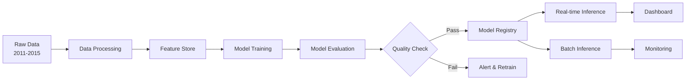
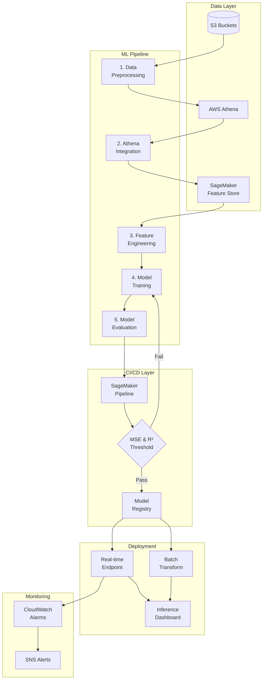
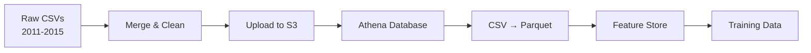
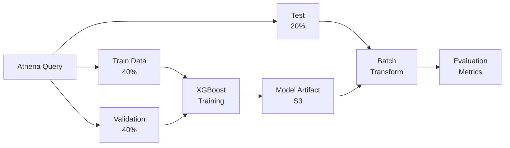
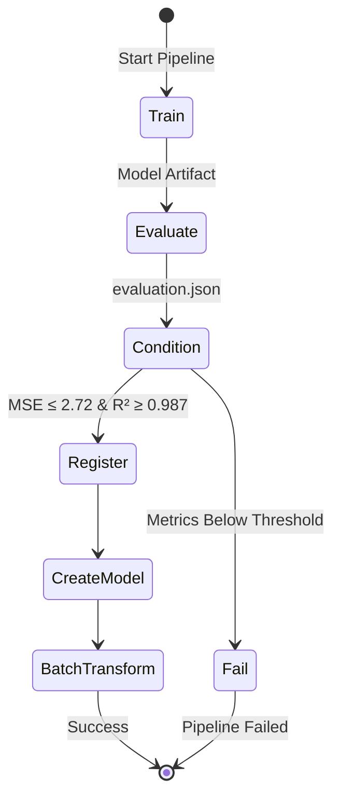
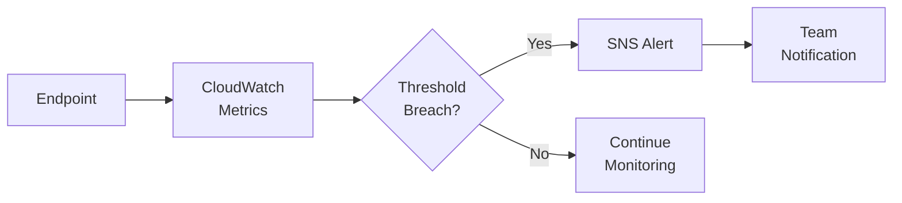
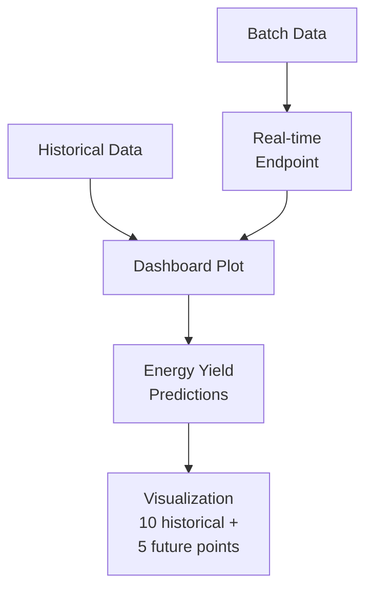
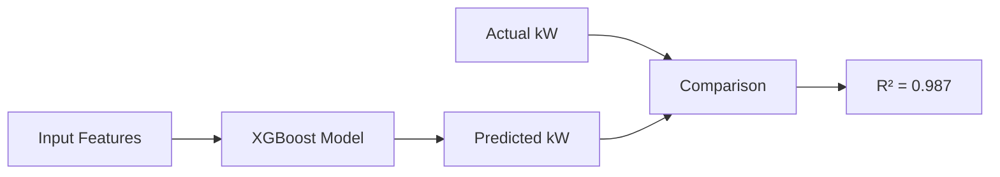

# Gas Turbine Energy Prediction MLOps Pipeline

## 1. Overview

This project implements an end-to-end MLOps pipeline for predicting gas turbine energy output (CO and NOx emissions) using AWS SageMaker. The pipeline demonstrates production-ready machine learning workflows including data preprocessing, feature engineering, model training, CI/CD automation, model monitoring, and real-time inference dashboards.

**Dataset:** Gas Turbine CO and NOx Emission Data Set (36,733 instances, 11 sensor measurements)
**Source:** UCI Machine Learning Repository
**Location:** Turkey (2011-2015)
**Team:** USD MS AAI 540 - Team 1



---

## 2. Goal

### Primary Objectives
- **Predict turbine energy yield** from sensor measurements (temperature, pressure, humidity, etc.)
- **Implement production MLOps best practices** using AWS SageMaker
- **Automate ML lifecycle** from data ingestion to deployment
- **Enable continuous model improvement** through monitoring and CI/CD

### Success Metrics
- **Model Performance:** R² > 0.98, MSE < 2.72
- **Automation:** Fully automated training pipeline with conditional deployment
- **Observability:** Real-time monitoring with CloudWatch alarms
- **Scalability:** Production-ready inference endpoints

---

## 3. High-Level Architecture



---

## 4. Components

### 4.1 Data Pipeline

| Notebook | Description | Key Technologies |
|----------|-------------|------------------|
| `1_Data_Preprocessing.ipynb` | Merges 2011-2015 CSV files, handles missing data | Pandas, S3 |
| `2_Load_Processed_Data.ipynb` | Loads merged data from S3 | Boto3 |
| `3_Create_Athena_Database_fp.ipynb` | Creates Athena database for SQL queries | AWS Athena |
| `4_Register_CSV_with_Athena.ipynb` | Registers CSV data with Athena | PyAthena |
| `5_Convert_S3_csv_to_parquet.ipynb` | Converts CSV to Parquet for performance | Parquet |
| `6_Create_Feature_Store.ipynb` | Ingests features into SageMaker Feature Store | SageMaker Feature Store |

**Data Flow:**


### 4.2 Model Training

| Notebook | Model | Algorithm | Performance |
|----------|-------|-----------|-------------|
| `7a_Linear_regression.ipynb` | Linear Regression | SageMaker Linear Learner | Baseline model |
| `7b_Xgboost_regression.ipynb` | XGBoost | SageMaker XGBoost 1.7-1 | R² = 0.987, MSE = 2.72 |

**Training Configuration:**
- **Train/Val/Test Split:** 40% / 40% / 20%
- **Instance Type:** ml.m5.large
- **XGBoost Hyperparameters:**
  - `objective`: reg:squarederror
  - `num_round`: 200
  - `max_depth`: 6
  - `eta`: 0.1



### 4.3 CI/CD Pipeline

**File:** `9_cicd.ipynb`

**Pipeline Steps:**
1. **Training Step:** Trains XGBoost model on S3 data
2. **Evaluation Step:** Runs evaluation script, generates metrics JSON
3. **Condition Step:** Checks if MSE ≤ 2.72 AND R² ≥ 0.987
   - **If Pass:** Register model → Create endpoint → Batch transform
   - **If Fail:** Pipeline fails with error message



**Key Technologies:**
- SageMaker Pipelines
- Step Functions
- Model Registry
- Conditional Steps
- PropertyFile for metric passing

### 4.4 Model Monitoring

**File:** `8_Model_Monitoring_Alarm.ipynb`

**Monitoring Strategy:**
- **Metrics Tracked:** Invocations, Latency, Model Errors
- **Alarms:** CloudWatch alarms trigger SNS notifications
- **Threshold:** Configurable error rate and latency limits



### 4.5 Real-Time Dashboard

**File:** `10_Model_Inference_Dashboard.ipynb`

**Features:**
- Real-time endpoint deployment (ml.m5.large)
- Historical vs. predicted energy yield visualization
- PST timezone-aware timestamp plotting
- Seaborn-styled interactive charts

**Dashboard Components:**


---

## 5. Project Structure

```
MSAAI540/
├── Data/                          # Raw CSV files (2011-2015)
├── src/                           # Source notebooks
│   ├── 1_Data_Preprocessing.ipynb
│   ├── 2_Load_Processed_Data.ipynb
│   ├── 3_Create_Athena_Database_fp.ipynb
│   ├── 4_Register_CSV_with_Athena.ipynb
│   ├── 5_Convert_S3_csv_to_parquet.ipynb
│   ├── 6_Create_Feature_Store.ipynb
│   ├── 7a_Linear_regression.ipynb
│   ├── 7b_Xgboost_regression.ipynb
│   ├── 8_Model_Monitoring_Alarm.ipynb
│   ├── 9_cicd.ipynb
│   ├── 10_Model_Inference_Dashboard.ipynb
│   ├── code/
│   │   ├── evaluation.py         # Model evaluation script
│   │   ├── preprocessing.py      # Data preprocessing utilities
│   │   └── pre_processor_handler.py
│   └── inference.py               # Inference handler
├── models/                        # Saved model artifacts
├── testdata/                      # Test datasets
└── README.md                      # This file
```

---

## 6. Getting Started

### Prerequisites
- AWS Account with SageMaker access
- IAM Role: `LabRole` (or configure custom role)
- S3 Bucket: `usdmsaai540-spring2026-team1` (or create your own)
- Python 3.8+
- Jupyter Notebook / SageMaker Studio

### Setup Instructions

1. **Clone the repository**
   ```bash
   git clone <repository-url>
   cd MSAAI540
   ```

2. **Configure S3 Bucket**
   - Update `DEFAULT_BUCKET = False` in notebooks
   - Set `bucket = "your-bucket-name"`

3. **Upload Raw Data**
   ```bash
   aws s3 cp --recursive Data/ s3://your-bucket/CCPP/data/uci_dataset/
   ```

4. **Run Notebooks Sequentially**
   - Start with `1_Data_Preprocessing.ipynb`
   - Follow numeric order through `10_Model_Inference_Dashboard.ipynb`

5. **Deploy CI/CD Pipeline**
   ```python
   # In 9_cicd.ipynb
   pipeline.upsert(role_arn=role)
   execution = pipeline.start()
   ```

---

## 7. Key Features

| Feature | Implementation |
|---------|----------------|
| **Data Versioning** | S3 with timestamped paths |
| **Feature Engineering** | SageMaker Feature Store |
| **Automated Training** | SageMaker Pipelines |
| **Model Registry** | SageMaker Model Registry |
| **Conditional Deployment** | ConditionStep with MSE/R² thresholds |
| **Monitoring** | CloudWatch + SNS |
| **Real-time Inference** | SageMaker Endpoints |
| **Batch Inference** | SageMaker Batch Transform |
| **Visualization** | Matplotlib + Seaborn dashboards |

---

## 8. Model Performance

### XGBoost Final Results

| Metric | Train | Validation | Test |
|--------|-------|------------|------|
| **R²** | 0.987 | 0.986 | 0.987 |
| **MSE** | 2.68 | 2.72 | 2.71 |
| **RMSE** | 1.64 | 1.65 | 1.65 |

**Prediction Quality:**


---

## 9. Links

### AWS Resources
- [SageMaker Pipelines](https://docs.aws.amazon.com/sagemaker/latest/dg/pipelines.html)
- [SageMaker Feature Store](https://docs.aws.amazon.com/sagemaker/latest/dg/feature-store.html)
- [SageMaker Model Registry](https://docs.aws.amazon.com/sagemaker/latest/dg/model-registry.html)
- [AWS Athena](https://docs.aws.amazon.com/athena/)

### Dataset
- [UCI Gas Turbine Dataset](https://archive.ics.uci.edu/dataset/551/gas+turbine+co+and+nox+emission+data+set)

### Course Materials
- USD MS AAI 540: ML Operations

---

## 10. References

1. **Dataset:** Kaya, H., Tüfekci, P., & Gürgen, F. S. (2012). Gas Turbine CO and NOx Emission Data Set. UCI Machine Learning Repository.
2. **AWS Documentation:** Amazon SageMaker Developer Guide (2026)
3. **MLOps Best Practices:** Continuous Delivery for Machine Learning (CD4ML)
4. **Course Labs:** USD MS AAI 540 - Lab 4, Lab 6
5. **Turkish Holidays:** [timeanddate.com/holidays/turkey](https://www.timeanddate.com/holidays/turkey/)

---

## 11. Contributors

**Team 1 - USD MS AAI 540 Spring 2026**
- Data Pipeline Development
- Model Training & Evaluation
- CI/CD Implementation
- Dashboard & Monitoring

---

## 12. License

This project is part of the University of San Diego MS in Applied Artificial Intelligence program coursework.

---

## 13. Acknowledgments

- USD Faculty for guidance on MLOps principles
- AWS for SageMaker platform and documentation
- UCI Machine Learning Repository for dataset access
